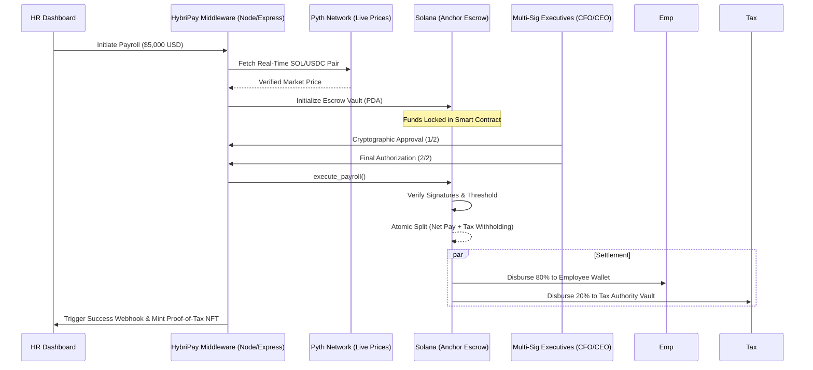

# 🏗️ HybriPay Technical Architecture

HybriPay is a **Hybrid Payment Middleware** that abstracts the complexity of the Solana blockchain into a familiar, enterprise-grade payroll interface.

---

## 1. The Global Money Lifecycle
This flowchart explains how a single payroll disbursement moves through the HybriPay protocol.

---

## 2. Core Protocol Pillars

### 🔐 Multi-Sig Governance
HybriPay utilizes a **2-Step Cryptographic Authorization** workflow. 
- **Stage 1 (Pending Approval)**: Payroll is staged in the database and visible to executives.
- **Stage 2 (Partially Approved)**: The first executive signs off, triggering a status transition and an immutable log.
- **Stage 3 (Finalized & Executed)**: The second executive authorizes the release, triggering the Anchor program to move funds.

### 🔮 Institutional Oracle Integration
We integrate directly with **Pyth Network's Hermes API** to provide institutional-grade pricing.
- **Solana Heartbeat**: Live SOL price updates every 10 seconds.
- **USDC Parity**: Constant monitoring of the stablecoin peg to ensure 100% payout accuracy.

### 📋 Compliance & Auditing (Proof-of-Tax)
The "Moat" of HybriPay is the **Atomic Tax Splitter**. 
- Every transaction is mathematically split into **Net Salary** and **Tax Liability** based on regional rules (USA, India, EU, Japan).
- These splits are recorded on the Solana ledger, creating a **Cryptographic Audit Trail** that eliminates the need for manual year-end reconciliation.

---

## 3. The On-Chain Layer (Anchor)
The `protocol/` directory contains the Rust source code for the **HybriPay Escrow Program.**
- **PDA (Program Derived Addresses)**: Each payroll batch gets a unique, secure vault address derived from the Batch ID.
- **Non-Custodial**: The middleware *never* has full control over the funds once deposited; it only facilitates the signatures required by the smart contract.

---

## 🛠️ Tech Stack & Modularity
- **Backend**: Express + Prisma (PostgreSQL) for high-speed indexing and metadata tracking.
- **Frontend**: Next.js + Framer Motion for a "Silicon Valley" premium user experience.
- **Infrastructure**: Fully containerized with Docker for "One-Click" deployment readiness.

---

### Developed for the Colosseum Solana Hackathon. 🚀
