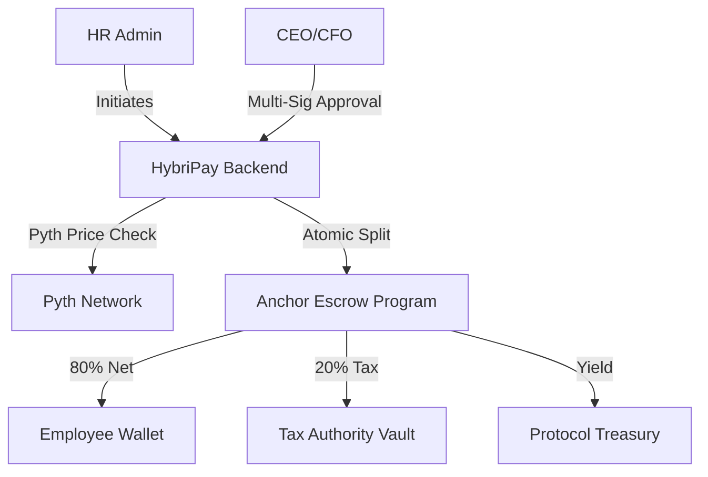

# 🚀 HybriPay: The Future of Global Payroll
### DeFi-Powered | Tax-Compliant | On-Chain Security

**HybriPay** is a venture-ready Web3 payroll protocol built on **Solana**. It disrupts the $60B global payroll industry by replacing slow legacy banking rails with instant, yield-bearing, and tax-compliant smart contracts.

[**Read the Technical Architecture (Mermaid Diagrams) 🏗️**](./ARCHITECTURE.md)

---

## ✨ Key Features

### 🏦 Yield-Bearing Escrow
Why pay for payroll software when the software can pay you? HybriPay generates **simulated 5% APY yield** on all funds held in escrow (integrating with protocols like JitoSOL and Kamino), enabling a **0% platform fee** business model.

### 🌍 Global Tax Splitter (Atomic Compliance)
Automatically route payments to regional tax authorities in **India (PAN)**, **USA (IRS)**, **Europe**, and **Japan** in a single atomic transaction. No manual calculations, no errors.

### 🔐 Executive Multi-Sig Authority
Secure corporate treasuries with a **2-of-2 Cryptographic Approval** system. Payroll is only released when both HR and the CFO provide their digital signatures.

### 🔮 Oracle-Intelligence (Pyth Network)
Leveraging high-fidelity price feeds from **Pyth Network** to ensure 100% accuracy in cross-border settlements and stablecoin parity tracking.

### 📋 Institutional Audit Hub
A dedicated hub for auditors to export **One-Click Compliance Reports (CSV/PDF)** and verify every settlement via immutable Solana signatures.

---

## 🛠️ Technical Stack

- **Blockchain**: Solana (L1)
- **Smart Contract**: Rust / Anchor (Escrow Protocol)
- **Price Oracle**: Pyth Network
- **Frontend**: Next.js 16 (App Router), Framer Motion, Tailwind v4
- **Backend**: Node.js, Express, Prisma ORM
- **Database**: PostgreSQL
- **Security**: HMAC-SHA256 Webhook signatures, Multi-Sig Authorization

---

## ⛓️ The On-Chain Protocol (Phase 10)

HybriPay moves funds through a **Non-Custodial Escrow Protocol**. 
- Funds are locked in a **Program Derived Address (PDA)**.
- The **Approval Matrix** tracks executive signatures on-chain.
- The **Atomic Settlement** releases funds to employees and tax vaults simultaneously.

---

## 🚀 Vision: The "Free Payroll" Model

Traditional payroll providers charge $50+ per employee/month. HybriPay’s "Moat" is the **Negative-Cost Model**:
1.  Company deposits $1M monthly payroll.
2.  Escrow generates **$1,600/month in yield**.
3.  HybriPay takes a small spread and provides the software **completely free** to the employer.

---

## 🏆 Why HybriPay Wins (Judge's Summary)
1.  **The "Tax Moat"**: Automating the world's most boring but critical problem—tax compliance.
2.  **The Yield Engine**: Moving from a cost-center (Payroll SaaS) to a profit-center (Yield Protocol).
3.  **Institutional UX**: A "Silicon Valley" interface that makes the blockchain invisible.
4.  **Proof-of-Tax NFTs**: A new standard for global accounting and verification.

---

## 🛠️ Getting Started (Demo Mode)

1. **Clone the Repo**
2. **Configure Environment**: Copy `.env.example` to `.env`.
3. **Run with Docker**:
   ```bash
   docker-compose up -d --build
   ```
4. **Access Dashboard**: `http://localhost:8080`
5. **VIP Demo Mode**: Enabled by default to bypass devnet faucet limitations.

---

---

## 🏗️ Technical Architecture



---

## 🔍 How to Review (Judge's Guide)

For a quick technical audit, please focus on these core modules:

- **Smart Contract**: `protocol/programs/hybripay_escrow/src/lib.rs` (The Anchor Escrow logic).
- **Tax Engine**: `src/services/tax.ts` (Atomic tax calculation & routing).
- **Oracle Service**: `src/services/oracle.ts` (Real-time Pyth Network integration).
- **Multi-Sig Logic**: `src/routes/approval.ts` (Incremental authorization workflow).
- **Audit Hub**: `frontend/src/app/reports/page.tsx` (Institutional reporting UI).

---

### Developed with 🦾 by the HybriPay Team.
